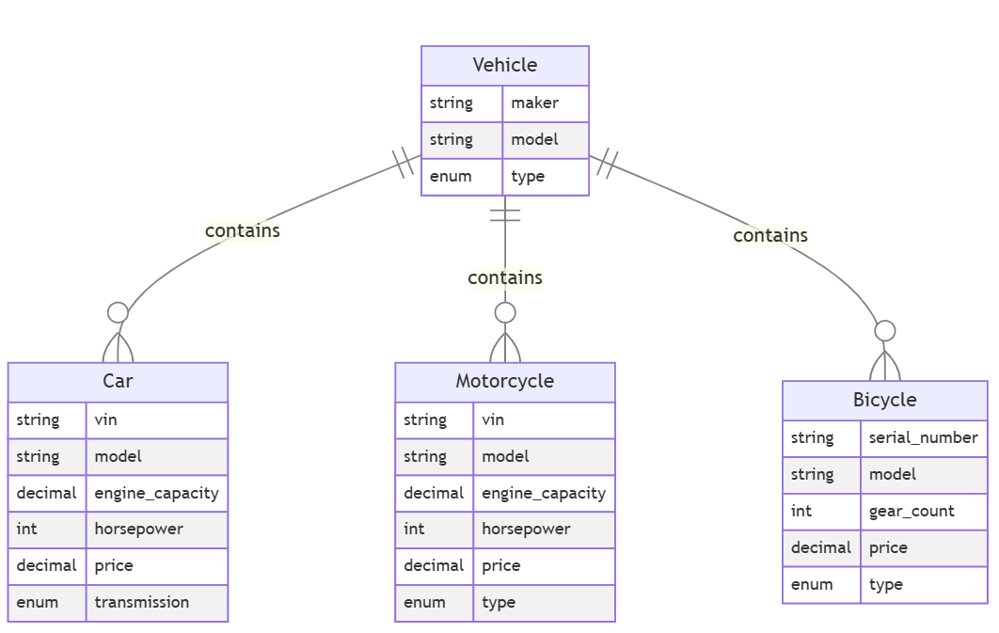
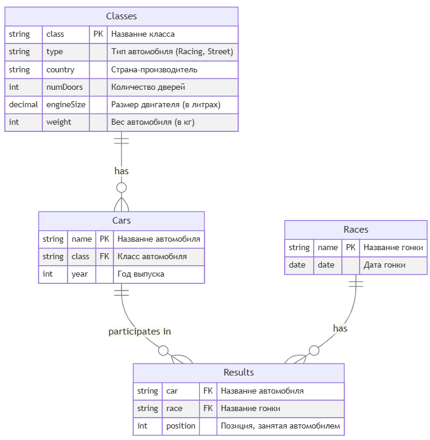
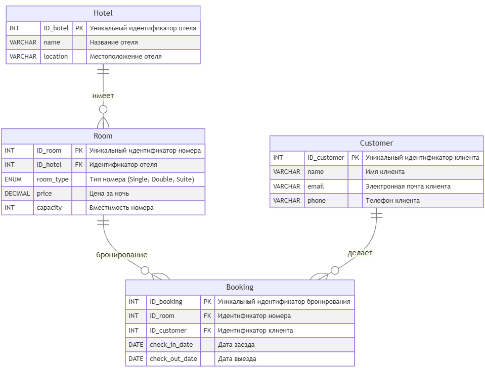

# Домашнее задание по дисциплине База данных

> [!IMPORTANT]
> Все задания необходимо выполнять на СУБД PostgreSQL

## База данных 1

[Скрипт создания базы данных](https://github.com/qutha/db-hw/blob/main/task1/create.sql)

[Скрипт наполнения базы данными](https://github.com/qutha/db-hw/blob/main/task1/seed.sql)

Схема базы данных

---

### Задание 1.1

Найдите производителей (maker) и модели всех мотоциклов, которые имеют мощность более 150 лошадиных сил, стоят менее 20 тысяч долларов и являются спортивными (тип Sport). Также отсортируйте результаты по мощности в порядке убывания.

[**Решение**](https://github.com/qutha/db-hw/blob/main/task1/task1_1.sql)

---

### Задание 1.2

Найти информацию о производителях и моделях различных типов транспортных средств (автомобили, мотоциклы и велосипеды), которые соответствуют заданным критериям.

1. Автомобили:

Извлечь данные о всех автомобилях, которые имеют:

- - Мощность двигателя более 150 лошадиных сил.
- - Объем двигателя менее 3 литров.
- - Цену менее 35 тысяч долларов.

В выводе должны быть указаны производитель (maker), номер модели (model), мощность (horsepower), объем двигателя (engine_capacity) и тип транспортного средства, который будет обозначен как Car.

2. Мотоциклы:

Извлечь данные о всех мотоциклах, которые имеют:

- - Мощность двигателя более 150 лошадиных сил.
- - Объем двигателя менее 1,5 литров.
- - Цену менее 20 тысяч долларов.

В выводе должны быть указаны производитель (maker), номер модели (model), мощность (horsepower), объем двигателя (engine_capacity) и тип транспортного средства, который будет обозначен как Motorcycle.

3. Велосипеды:
Извлечь данные обо всех велосипедах, которые имеют:

- - Количество передач больше 18.
- - Цену менее 4 тысяч долларов.

В выводе должны быть указаны производитель (maker), номер модели (model), а также NULL для мощности и объема двигателя, так как эти характеристики не применимы для велосипедов. Тип транспортного средства будет обозначен как Bicycle.

4. Сортировка:
- - Результаты должны быть объединены в один набор данных и отсортированы по мощности в порядке убывания. Для велосипедов, у которых нет значения мощности, они будут располагаться внизу списка.

[**Решение**](https://github.com/qutha/db-hw/blob/main/task1/task1_2.sql)

---

## База данных 2

[Скрипт создания базы данных](https://github.com/qutha/db-hw/blob/main/task2/create.sql)

[Скрипт наполнения базы данными](https://github.com/qutha/db-hw/blob/main/task2/seed.sql)

Схема базы данных

---

### Задание 2.1

Определить, какие автомобили из каждого класса имеют наименьшую среднюю позицию в гонках, и вывести информацию о каждом таком автомобиле для данного класса, включая его класс, среднюю позицию и количество гонок, в которых он участвовал. Также отсортировать результаты по средней позиции.

[**Решение**](https://github.com/qutha/db-hw/blob/main/task1/task2_1.sql)

---

### Задание 2.2

Определить автомобиль, который имеет наименьшую среднюю позицию в гонках среди всех автомобилей, и вывести информацию об этом автомобиле, включая его класс, среднюю позицию, количество гонок, в которых он участвовал, и страну производства класса автомобиля. Если несколько автомобилей имеют одинаковую наименьшую среднюю позицию, выбрать один из них по алфавиту (по имени автомобиля).

[**Решение**](https://github.com/qutha/db-hw/blob/main/task1/task2_2.sql)

---

### Задание 2.3

Определить классы автомобилей, которые имеют наименьшую среднюю позицию в гонках, и вывести информацию о каждом автомобиле из этих классов, включая его имя, среднюю позицию, количество гонок, в которых он участвовал, страну производства класса автомобиля, а также общее количество гонок, в которых участвовали автомобили этих классов. Если несколько классов имеют одинаковую среднюю позицию, выбрать все из них.

[**Решение**](https://github.com/qutha/db-hw/blob/main/task1/task2_3.sql)

---

### Задание 2.4

Определить, какие автомобили имеют среднюю позицию лучше (меньше) средней позиции всех автомобилей в своем классе (то есть автомобилей в классе должно быть минимум два, чтобы выбрать один из них). Вывести информацию об этих автомобилях, включая их имя, класс, среднюю позицию, количество гонок, в которых они участвовали, и страну производства класса автомобиля. Также отсортировать результаты по классу и затем по средней позиции в порядке возрастания.

[**Решение**](https://github.com/qutha/db-hw/blob/main/task1/task2_4.sql)

---

### Задание 2.5

Определить, какие классы автомобилей имеют наибольшее количество автомобилей с низкой средней позицией (больше 3.0) и вывести информацию о каждом автомобиле из этих классов, включая его имя, класс, среднюю позицию, количество гонок, в которых он участвовал, страну производства класса автомобиля, а также общее количество гонок для каждого класса. Отсортировать результаты по количеству автомобилей с низкой средней позицией.

[**Решение**](https://github.com/qutha/db-hw/blob/main/task1/task2_5.sql)

---

## База данных 3

[Скрипт создания базы данных](https://github.com/qutha/db-hw/blob/main/task3/create.sql)

[Скрипт наполнения базы данными](https://github.com/qutha/db-hw/blob/main/task3/seed.sql)

Схема базы данных

---

### Задание 3.1

Определить, какие клиенты сделали более двух бронирований в разных отелях, и вывести информацию о каждом таком клиенте, включая его имя, электронную почту, телефон, общее количество бронирований, а также список отелей, в которых они бронировали номера (объединенные в одно поле через запятую с помощью CONCAT). Также подсчитать среднюю длительность их пребывания (в днях) по всем бронированиям. Отсортировать результаты по количеству бронирований в порядке убывания.

[**Решение**](https://github.com/qutha/db-hw/blob/main/task1/task3_1.sql)

---

### Задание 3.2

Необходимо провести анализ клиентов, которые сделали более двух бронирований в разных отелях и потратили более 500 долларов на свои бронирования. Для этого:

- Определить клиентов, которые сделали более двух бронирований и забронировали номера в более чем одном отеле. Вывести для каждого такого клиента следующие данные: ID_customer, имя, общее количество бронирований, общее количество уникальных отелей, в которых они бронировали номера, и общую сумму, потраченную на бронирования.
- Также определить клиентов, которые потратили более 500 долларов на бронирования, и вывести для них ID_customer, имя, общую сумму, потраченную на бронирования, и общее количество бронирований.
- В результате объединить данные из первых двух пунктов, чтобы получить список клиентов, которые соответствуют условиям обоих запросов. Отобразить поля: ID_customer, имя, общее количество бронирований, общую сумму, потраченную на бронирования, и общее количество уникальных отелей.
- Результаты отсортировать по общей сумме, потраченной клиентами, в порядке возрастания.

[**Решение**](https://github.com/qutha/db-hw/blob/main/task1/task3_2.sql)

---

### Задание 3.3

Вам необходимо провести анализ данных о бронированиях в отелях и определить предпочтения клиентов по типу отелей. Для этого выполните следующие шаги:

1. Категоризация отелей.

Определите категорию каждого отеля на основе средней стоимости номера:

- - «Дешевый»: средняя стоимость менее 175 долларов.
- - «Средний»: средняя стоимость от 175 до 300 долларов.
- - «Дорогой»: средняя стоимость более 300 долларов.

2. Анализ предпочтений клиентов.

Для каждого клиента определите предпочитаемый тип отеля на основании условия ниже:

- - Если у клиента есть хотя бы один «дорогой» отель, присвойте ему категорию «дорогой».
- - Если у клиента нет «дорогих» отелей, но есть хотя бы один «средний», присвойте ему категорию «средний».
- - Если у клиента нет «дорогих» и «средних» отелей, но есть «дешевые», присвойте ему категорию предпочитаемых отелей «дешевый».

3. Вывод информации.

Выведите для каждого клиента следующую информацию:

- - ID_customer: уникальный идентификатор клиента.
- - name: имя клиента.
- - preferred_hotel_type: предпочитаемый тип отеля.
- - visited_hotels: список уникальных отелей, которые посетил клиент.

4. Сортировка результатов.

Отсортируйте клиентов так, чтобы сначала шли клиенты с «дешевыми» отелями, затем со «средними» и в конце — с «дорогими».